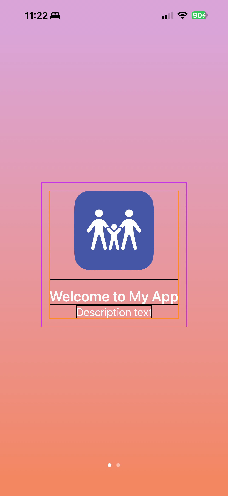
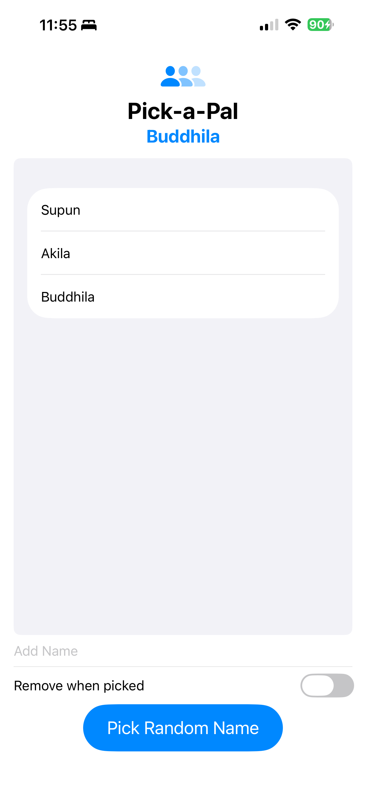
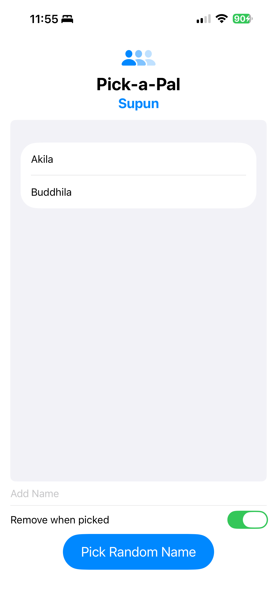
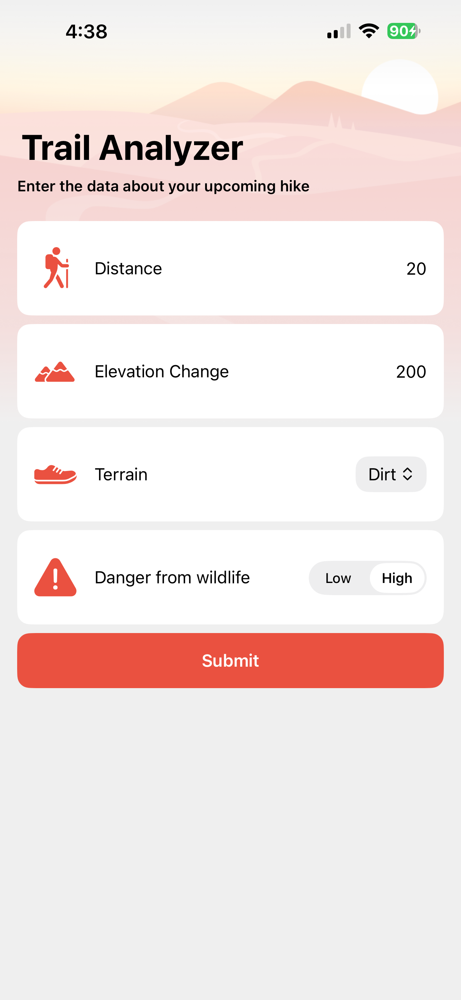
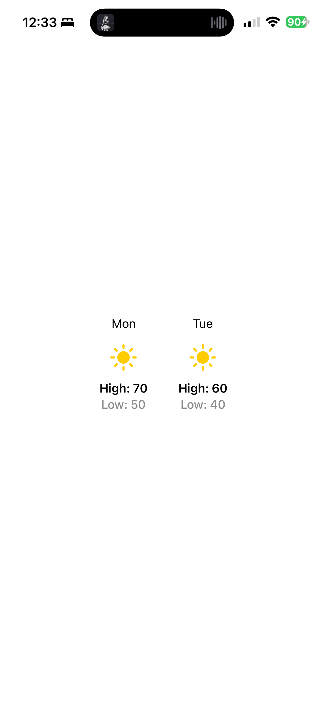

# 📱 iOS Mini Projects

A collection of SwiftUI mini apps built while learning core iOS development concepts — from animations and onboarding flows to Core ML integration.

> Built with SwiftUI · Xcode · iOS 16+

---

## Projects

| # | App | Description |
|---|-----|-------------|
| 1 | [DiceView](#1-diceview) | Animated multi-dice roller |
| 2 | [OnboardingFlow](#2-onboardingflow) | Paginated onboarding experience |
| 3 | [Pick-a-Pal](#3-pick-a-pal) | Random name picker for groups |
| 4 | [TrailAnalyzer](#4-trailanalyzer) | ML-powered trail risk predictor |
| 5 | [WeatherForecast](#5-weatherforecast) | Component-based forecast UI |

---

## 1. DiceView

An interactive dice roller with dynamic dice management and smooth roll animations.

**What I learned:** Reusable view components, `withAnimation`, SF Symbols, dynamic state management

**Features**
- Add or remove dice (1–5 at a time)
- Animated roll results using `withAnimation`
- Reusable `DiceView` component
- Styled UI with SF Symbols controls

**Core Files**
```
DiceView/DiceView/
├── ContentView.swift
└── DiceView.swift
```

**Screenshots**

| Default | After Roll |
|---------|------------|
|  |  |

---

## 2. OnboardingFlow

A multi-page onboarding experience using `TabView` with a page-style layout and reusable feature cards.

**What I learned:** `.tabViewStyle(.page)`, asset catalog colors, gradient theming, component decomposition

**Features**
- Paginated onboarding with `.tabViewStyle(.page)`
- Gradient-themed UI using asset colors
- Dedicated welcome and features pages
- Reusable `FeatureCard` component for scalable content

**Core Files**
```
OnboardingFlow/OnboardingFlow/
├── ContentView.swift
├── WelcomePage.swift
├── FeaturesPage.swift
└── FeatureCard.swift
```

**Screenshots**

| Welcome Page | Features Page |
|-------------|---------------|
|  |  |

---

## 3. Pick-a-Pal

A random name picker built for classrooms, teams, and group activities.

**What I learned:** Text field submission, list management, randomization, optional state handling

**Features**
- Add names quickly via text field submit
- View all names in a scrollable list
- Randomly pick a name from the pool
- Optionally remove selected names to avoid repeats

**Core Files**
```
Pick-a-Pal/Pick-a-Pal/
└── ContentView.swift
```

**Screenshots**

| Name List | Random Pick |
|-----------|-------------|
|  |  |

---

## 4. TrailAnalyzer

A trail risk prediction app powered by a custom Core ML model. Users input trail data and receive a categorized risk assessment with guidance.

**What I learned:** Core ML integration, form-based input, model training with Create ML, custom theming

**Features**
- Form-based input: distance, elevation, terrain type, wildlife danger
- On-device ML prediction using a trained `TrailAnalyzerModel`
- Four risk categories: Easy · Moderate · Difficult · High Risk
- Detailed results with summary risk cards
- Custom app theming via `TrailTheme`

**Core Files**
```
TrailAnalyzer/TrailAnalyzer/
├── Views/
│   ├── ContentView.swift
│   ├── TrailInfoView.swift
│   └── PredictionView.swift
└── Models/
    ├── TrailAnalyzer.swift
    ├── TrailAnalyzerModel.mlmodel
    ├── Risk.swift
    ├── TrailInfo.swift
    └── Terrain.swift
```

**ML Artifacts**
```
TrailAnalyzer.mlproj/
TrailAnalyzer.mlmodel
```

**Screenshots**

| Input Form | Prediction Result |
|------------|-------------------|
|  |  |

---

## 5. WeatherForecast

A clean forecast UI demonstrating component-based design patterns and computed properties in SwiftUI.

**What I learned:** Reusable view components, computed properties, conditional rendering based on data

**Features**
- Reusable `DayForecast` view component
- Conditional icon and color rendering based on weather conditions
- Clean horizontal forecast layout

**Core Files**
```
WeatherForecast/WeatherForecast/
└── ContentView.swift
```

**Screenshots**

| Forecast View | Conditions |
|---------------|------------|
|  |  |

---

## Running the Apps

1. Open the `.xcodeproj` file for the desired app in Xcode
2. Select an iOS Simulator or connected physical device
3. Press `Cmd + R` to build and run

> Requires Xcode 14+ and iOS 16 or later. TrailAnalyzer requires a device/simulator with Core ML support (all modern iOS simulators qualify).

---

## Tech Stack

- **Language:** Swift 5.9
- **UI Framework:** SwiftUI
- **ML:** Core ML + Create ML (TrailAnalyzer)
- **IDE:** Xcode 14+
- **Target:** iOS 16+
