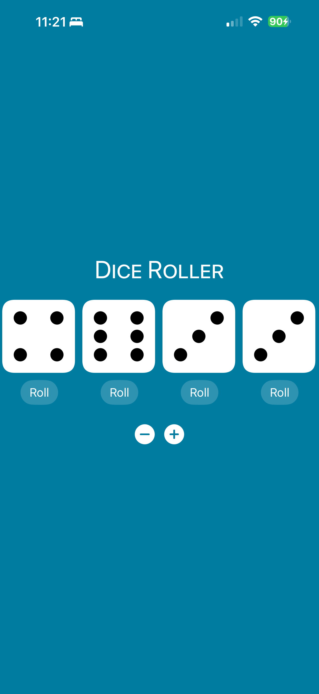

# iOS Mini Projects

A collection of SwiftUI mini apps built while learning iOS development concepts.

## Projects Included

1. DiceView
2. OnboardingFlow
3. Pick-a-Pal
4. TrailAnalyzer
5. WeatherForecast

---

## 1) DiceView

Interactive dice roller that lets users add or remove dice and view random rolls with animation.

### Highlights
- Dynamic dice count from 1 to 5
- Reusable custom `DiceView` component
- Animated UI updates with `withAnimation`
- Styled background and SF Symbols controls

### Core Files
- `DiceView/DiceView/ContentView.swift`
- `DiceView/DiceView/DiceView.swift`

### Screenshots

---

## 2) OnboardingFlow

Multi-page onboarding experience built with `TabView` and a custom feature card layout.

### Highlights
- Paginated onboarding using `.tabViewStyle(.page)`
- Gradient-themed UI with asset colors
- Dedicated welcome page and features page
- Reusable `FeatureCard` component for scalable onboarding content

### Core Files
- `OnboardingFlow/OnboardingFlow/ContentView.swift`
- `OnboardingFlow/OnboardingFlow/WelcomePage.swift`
- `OnboardingFlow/OnboardingFlow/FeaturesPage.swift`
- `OnboardingFlow/OnboardingFlow/FeatureCard.swift`

### Screenshots

---

## 3) Pick-a-Pal

A random name picker app for groups, classrooms, and team activities.

### Highlights
- Add names quickly via text field submit
- Display all names in a list
- Randomly pick a name from the current list
- Optional removal of selected names to avoid repeats

### Core Files
- `Pick-a-Pal/Pick-a-Pal/ContentView.swift`

### Screenshots

---

## 4) TrailAnalyzer

Trail risk prediction app powered by Core ML. Users enter trail data and receive a risk category with guidance.

### Highlights
- Form-based trail data input (distance, elevation, terrain, wildlife danger)
- Core ML prediction using generated `TrailAnalyzerModel`
- Risk categorization: Easy, Moderate, Difficult, High Risk
- Result details with additional risk summary cards
- Custom app theming via `TrailTheme`

### Core Files
- `TrailAnalyzer/TrailAnalyzer/Views/ContentView.swift`
- `TrailAnalyzer/TrailAnalyzer/Views/TrailInfoView.swift`
- `TrailAnalyzer/TrailAnalyzer/Views/PredictionView.swift`
- `TrailAnalyzer/TrailAnalyzer/Models/TrailAnalyzer.swift`
- `TrailAnalyzer/TrailAnalyzer/Models/Risk.swift`
- `TrailAnalyzer/TrailAnalyzer/Models/TrailInfo.swift`
- `TrailAnalyzer/TrailAnalyzer/Models/Terrain.swift`

### ML Training Artifacts
- `TrailAnalyzer.mlproj/`
- `TrailAnalyzer .mlmodel`
- `TrailAnalyzer/TrailAnalyzer/Models/TrailAnalyzerModel.mlmodel`

### Screenshots

---

## 5) WeatherForecast

A simple forecast UI demonstrating component-based design and computed properties in SwiftUI.

### Highlights
- Reusable `DayForecast` view component
- Conditional icon and color rendering based on weather conditions
- Clean horizontal forecast layout

### Core Files
- `WeatherForecast/WeatherForecast/ContentView.swift`

### Screenshots

---

## Running the Apps

1. Open the corresponding `.xcodeproj` file for any app.
2. Select an iOS Simulator or physical device.
3. Build and run from Xcode.

## Screenshot File Structure

Add your screenshot files to these paths so all README images render correctly:

- `Screenshots/DiceView/screenshot-1.png`
- `Screenshots/DiceView/screenshot-2.png`
- `Screenshots/OnboardingFlow/screenshot-1.png`
- `Screenshots/OnboardingFlow/screenshot-2.png`
- `Screenshots/Pick-a-Pal/screenshot-1.png`
- `Screenshots/Pick-a-Pal/screenshot-2.png`
- `Screenshots/TrailAnalyzer/screenshot-1.png`
- `Screenshots/TrailAnalyzer/screenshot-2.png`
- `Screenshots/WeatherForecast/screenshot-1.png`
- `Screenshots/WeatherForecast/screenshot-2.png`
